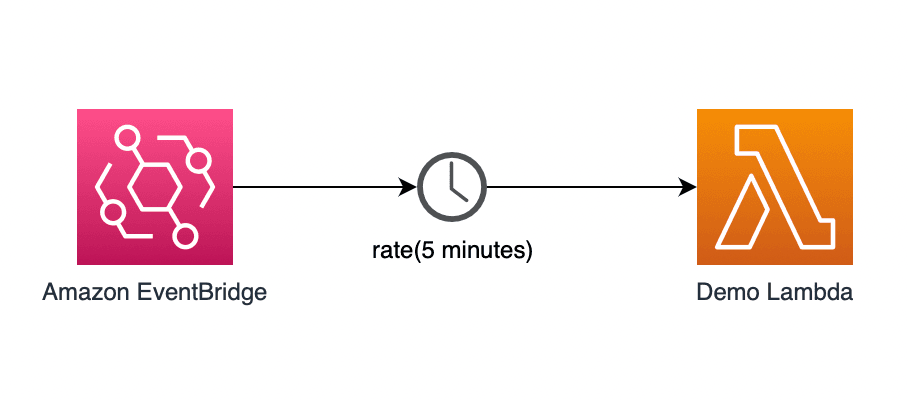

# AWS Lambda Schedule

## A Scheduled Task in AWS 

[Amazon EventBridge Scheduler](https://docs.aws.amazon.com/scheduler/latest/UserGuide/what-is-scheduler.html) is a serverless scheduler that allows you to create, run, and manage tasks from one central, managed service. With EventBridge Scheduler, you can create schedules using cron and rate expressions for recurring patterns, or configure one-time invocations. You can set up flexible time windows for delivery, define retry limits, and set the maximum retention time for unprocessed events.

When you set up EventBridge Scheduler with Lambda, EventBridge Scheduler invokes your Lambda function asynchronously. 



> These instructions are for Mac, some commands will be different on a Windows system.

## Cost


| Service     | Region | Cost   | 
| ---         | ---    | ---    |
| Eventbridge Scheduler Invocations   | ap-southeast-2    | $1.20/million scheduled invocations per month. | 
| Lambda Execution | ap-southeast-2 | 	$0.0000000067 / 1 ms + $0.000000037 for every GB-second |


## Prerequisites

Besides having `dotnet`, `npm` and `node` installed you will need to have the following tools and CLI's:

- Lambda Tools  
  `dotnet tool install -g Amazon.Lambda.Tools`
    
- Lambda Templates  
  `dotnet new install Amazon.Lambda.Templates`

- Lambda Test Tool  
  `dotnet tool install -g Amazon.Lambda.TestTool-8.0`

- AWS CLI      
   See [instructions](https://docs.aws.amazon.com/cli/latest/userguide/getting-started-install.html)

- AWS CDK CLI  
  `npm install -g aws-cdk`

- AWS SAM 
   Follow these commands to install SAM:       
    ```
    brew tap aws/tap
    brew install aws-sam-cli

    sam --version
    ```

To use `CDK` locally you will need to have `docker`. It will use that to bundle the lambda source asset.

## Setup Project

Create a new project for the solution:

```shell
mkdir AWS.Lambda.Schedule
cd AWS.Lambda.Schedule
git init --initial-branch=main
dotnet new gitignore
dotnet new sln
```

## Create the Schedule Lambda

Add the actual lambda that will be scheduled to run at specific interval:

```shell
dotnet new lambda.EmptyFunction -n Schedule.Lambda
```

Change the project structure as well as remove the test project for now.

```shell
mv Schedule.Lambda/src src
rm -r Schedule.Lambda
dotnet sln add **/*.csproj
```

Ensure that it all builds.

```shell
dotnet build
```

Commit changes

```shell
git add .
git commit -m 'Initial, empty project'
```

## Update the Lambda

Now we need to modify the lambda so it can accept the scheduled event.

Add required nuget packages:

` dotnet add ./src/Schedule.Lambda/Schedule.Lambda.csproj package Amazon.Lambda.CloudWatchEvents`

Update the function handler in file `.\src\Schedule.Lambda\Function.cs` so it accepts input from the Eventbridge scheduler.

```csharp
using System.Text.Json;

using Amazon.Lambda.CloudWatchEvents;
using Amazon.Lambda.Core;

// Assembly attribute to enable the Lambda function's JSON input to be converted into a .NET class.
[assembly: LambdaSerializer(typeof(Amazon.Lambda.Serialization.SystemTextJson.DefaultLambdaJsonSerializer))]

namespace Schedule.Lambda;

public class Function
{
    public void FunctionHandler(CloudWatchEvent<dynamic> input, ILambdaContext context)
    {
        // All log statements are written to CloudWatch by default. For more information, see
        // https://docs.aws.amazon.com/lambda/latest/dg/csharp-logging.html
        context.Logger.LogLine(JsonSerializer.Serialize(input));
    }
}
```

Ensure that it all builds.

```
dotnet build
```

Commit changes

```
git add .
git commit -m 'Add Schedule Lambda'
```

## Add a CDK Project

Lets start by creating a project that is responsible to maintain all infrastructure in the solution. We will use AWS CDK for this purpose.

The cdk init command must be executed in an empty directory and it takes the project name from the current directory:

```shell
mkdir cdk
cd cdk
cdk init --generate-only  app --language csharp
cd ..
```

The cdk tool creates a project structure that needs to be adjusted to our project structure:

```shell
mv cdk/.gitignore . 
mv cdk/cdk.json .
rm -r cdk/README.md
rm -r cdk/src/Cdk.sln
mv cdk/src/Cdk/*.*  cdk
rm -r cdk/src
mv cdk/Cdk.csproj cdk/AWS.Lambda.Schedule.CDK.csproj
mv cdk/CdkStack.cs cdk/ApplicationStack.cs
find . -name cdk.json -type f | xargs sed -i '' -e 's|src/Cdk/Cdk.csproj|cdk/AWS.Lambda.Schedule.CDK.csproj|g'
```

Add the CDK project to the solution:  
`dotnet sln add **/*.csproj`

Update the `cdk\Program.cs`

```csharp
using Amazon.CDK;

namespace AWS.Lambda.Schedule.CDK
{
    sealed class Program
    {
        public static void Main(string[] args)
        {
            var app = new App();
            new ApplicationStack(app, "ScheduleLambda", new StackProps
            {
            });
            app.Synth();
        }
    }
}
```

Update the `cdk\ApplicationStack.cs` so it creates all required infrastructure:

```csharp
using Amazon.CDK;
using Amazon.CDK.AWS.IAM;
using Amazon.CDK.AWS.Lambda;
using Amazon.CDK.AWS.Scheduler;
using Constructs;
using static Amazon.CDK.AWS.Scheduler.CfnSchedule;

namespace AWS.Lambda.Schedule.CDK
{
    public class ApplicationStack : Stack
    {
        internal ApplicationStack(Construct scope, string id, IStackProps props = null) : base(scope, id, props)
        {
            var buildOption = new BundlingOptions()
            {
                Image = Runtime.DOTNET_8.BundlingImage,
                User = "root",
                OutputType = BundlingOutput.ARCHIVED,
                Command = new string[]{
               "/bin/sh",
                "-c",
                " dotnet tool install -g Amazon.Lambda.Tools"+
                " && dotnet build"+
                " && dotnet lambda package --output-package /asset-output/Schedule.Lambda.zip -c Release --f net8 -farch arm64"
                }
            };

            var handler = new Function(this, "scheduler-lambda", new FunctionProps
            {
                MemorySize = 512,
                Timeout = Duration.Seconds(30),
                Runtime = Runtime.DOTNET_8,
                Architecture = Architecture.ARM_64,
                Handler = "Schedule.Lambda::Schedule.Lambda.Function::FunctionHandler",
                Code = Code.FromAsset("./src/Schedule.Lambda/", new Amazon.CDK.AWS.S3.Assets.AssetOptions
                {
                    Bundling = buildOption
                })
            });

            var schedulerRole = new Role(this, "scheduler-role", new RoleProps
            {
                AssumedBy = new ServicePrincipal("scheduler.amazonaws.com")
            });

            var inlinePolicy = new Policy(this, "schedule-policy", new PolicyProps
            {
                PolicyName = "ScheduleToInvokeLambdas",
                Roles = new[] { schedulerRole },
                Statements = new[]
                 {
                    new PolicyStatement(new PolicyStatementProps
                    {
                        Effect = Effect.ALLOW,
                        Actions = new [] { "lambda:InvokeFunction"},
                        Resources = new [] { handler.FunctionArn }
                    })
                }
            });

            var scheduleGroup = new CfnScheduleGroup(this, "schedule-group", new CfnScheduleGroupProps
            {
                Name = "schedule-group-lambda"
            });

            var schedule = new CfnSchedule(this, "schedule-lambda", new CfnScheduleProps
            {
                GroupName = scheduleGroup.Name,
                FlexibleTimeWindow = new FlexibleTimeWindowProperty
                {
                    Mode = "OFF",
                },
                ScheduleExpression = "rate(5 minute)",
                Target = new TargetProperty
                {
                    Arn = handler.FunctionArn,
                    RoleArn = schedulerRole.RoleArn
                },
                Name = "schedule-lambda"
            });

        }
    }
}
```

Modify the `ScheduleExpression` to match the time interval you need.

Ensure that it all builds.

```shell
dotnet build
```

You can now test the lambda by running the AWS Mock Lambda Tool:

> Select the `Scheduled Event` example request and press `Execute Function`

```shell
dotnet build -c release
dotnet lambda-test-tool-8.0
```

You can read more about the lambda test tool [here](https://github.com/aws/aws-lambda-dotnet/blob/master/Tools/LambdaTestTool/README.md), including how to run it without UI and how to configure your IDE to run it with debug mode.

If you have AWS CLI setup then you can deploy the CDK stack:

```shell
cdk synth
cdk deploy
```

Check execution logs using `sam` [more info](https://docs.aws.amazon.com/serverless-application-model/latest/developerguide/sam-cli-command-reference-sam-logs.html)

```shell
sam logs  --stack-name ScheduleLambda
```

This will display something like, at least it should display no errors :

```shell
2024/10/31/[$LATEST]79f9d68400e740b9b5ad4624f4205313 2024-10-31T10:02:15.158000 INIT_START Runtime Version: dotnet:8.v26	Runtime Version ARN: arn:aws:lambda:ap-southeast-2::runtime:b509212318ec668e451dcfcbb2ef5a20d0bc8ac57283fc9cc3fbd7c9d5f14668
2024/10/31/[$LATEST]79f9d68400e740b9b5ad4624f4205313 2024-10-31T10:02:15.456000 START RequestId: 83672355-7e84-4f9c-8663-407ad3355a46 Version: $LATEST
2024/10/31/[$LATEST]79f9d68400e740b9b5ad4624f4205313 2024-10-31T10:02:15.694000 2024-10-31T10:02:15.658Z	83672355-7e84-4f9c-8663-407ad3355a46	info	{"Version":"0","Account":"888988597065","Region":"ap-southeast-2","Detail":"{}","detail-type":"Scheduled Event","Source":"aws.scheduler","Time":"2024-10-31T10:01:34Z","Id":"83672355-7e84-4f9c-8663-407ad3355a46","Resources":["arn:aws:scheduler:ap-southeast-2:888988597065:schedule/schedule-group-lambda/schedule-lambda"]}
2024/10/31/[$LATEST]79f9d68400e740b9b5ad4624f4205313 2024-10-31T10:02:15.736000 END RequestId: 83672355-7e84-4f9c-8663-407ad3355a46
2024/10/31/[$LATEST]79f9d68400e740b9b5ad4624f4205313 2024-10-31T10:02:15.736000 REPORT RequestId: 83672355-7e84-4f9c-8663-407ad3355a46	Duration: 278.82 ms	Billed Duration: 279 ms	Memory Size: 512 MB	Max Memory Used: 67 MB	Init Duration: 296.10 ms
```

Remove the deployment:

```
cdk destroy
```

Commit changes

```
git add .
git commit -m 'Add CDK Lambda'
```